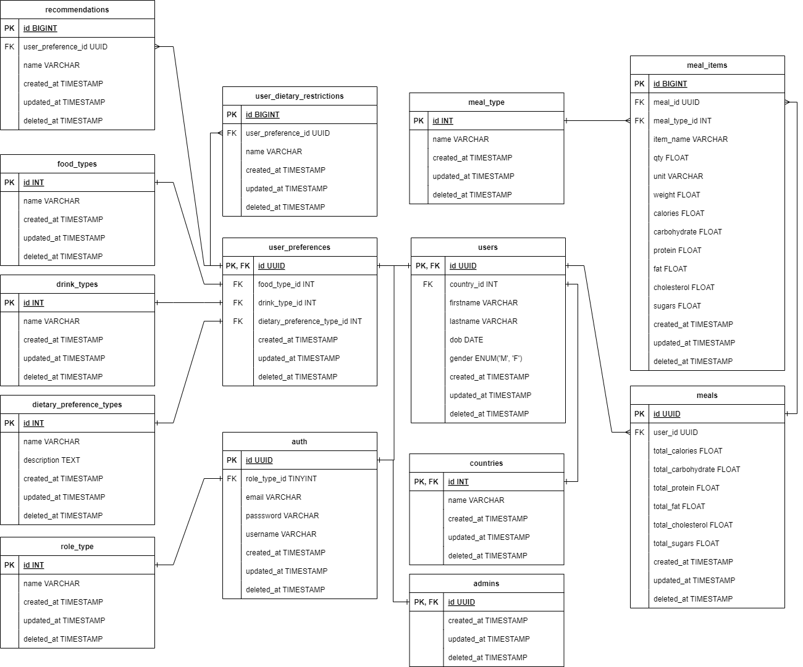

# NutriPlans

## About Project
***NutriPlans*** hadir sebagai solusi bagi orang-orang yang ingin mengelola **asupan nutrisi** dengan **mudah** dan **efektif**. Aplikasi ini akan membantu menjaga **kesehatan** dan **keseimbangan tubuh** terutama dalam pengelolaan makanan yang dikonsumsi, dengan cara memastikan pengguna mendapatkan **nutrisi** yang **tepat** dalam jumlah yang tidak kurang ataupun lebih.

## Features
### User
- Melakukan registrasi akun
- Melakukan *login*
- Menambahkan detail profil
- Mengelola preferensi *user* terkait makanan seperti kategori makanan, kategori minuman, dan *dietary restriction*
- Mengelola *meal* yang akan/sedang dikonsumsi setiap harinya yang dibagi menjadi 4 bagian (*breakfast*, *lunch*, *dinner*, *additional*)
- Mencari makanan/minuman yang ingin dimasukkan ke dalam meal
- Melihat *meal history* yang telah dikonsumsi beserta dengan detail nutrisi
- Melihat nutrisi pada makanan/minuman
- Melihat kalkulasi nutrisi yang dikonsumsi setiap harinya
- Mendapatkan rekomendasi makanan/minuman yang ingin dikonsumsi berdasarkan preferensi


### Admin
- Mengelola akun *user*
- Mengelola tipe makanan, minuman, dan *dietary preference*

## Tech Stacks
- [Golang](https://go.dev/)
- [Echo](https://echo.labstack.com/)
- [Gorm](https://gorm.io/index.html)
- [JWT](https://jwt.io/)
- [Cron](https://pkg.go.dev/github.com/robfig/cron)
- [OpenAI](https://openai.com/)
- [Mockery](https://github.com/vektra/mockery)
- [Testify](https://github.com/stretchr/testify)
- [PostgreSQL](https://www.postgresql.org/)
- [Docker](https://www.docker.com/)
- [AWS EC2](https://aws.amazon.com/ec2/)
- [AWS ECS](https://aws.amazon.com/ecs/)
- [AWS ECR](https://aws.amazon.com/ecr/)
- [AWS RDS](https://aws.amazon.com/rds/)
- [GitHub Action](https://docs.github.com/actions)
- [Codecov](https://about.codecov.io/)

## API Documentation
[NutriPlans API](https://nutri-plans-api.steel.my.id/)

## ERD


## Setup 

### Prerequisites
- Docker
- Docker compose
- Make

### Getting Started
1. Clone or fork this repository to your local computer.
    ```bash
      git clone https://github.com/ramsteel/nutri-plans-api.git
    ```
2. Navigate to project directory.
    ```bash
      cd nutri-plans-api
    ```
3. Copy example environment variable to .env file.
    ```bash
      cp .env.example .env
    ```
4. Fill in the environment data as usual. For variables with the ```DB``` prefix, fill using data related to your **database**, but in this project using **PostgreSQL**. Next, ```JWT_KEY``` is filled with the JWT secret key that you defined.
5. For the last three environments, the data can only be obtained from external service providers. Such as ```NUTRITIONIX_APP_ID``` and ```NUTRITIONIX_APP_KEY``` can be obtained after registering to the [Nutritionix API](https://developer.nutritionix.com/). And then, ```OPENAI_API_KEY``` can be obtained from logged in with **unregistered account** & **phone numbers** to get free trial or add the credit balance because this API isn't free.
6. After above setups, you can simply run the docker container using this command.
    ```bash
      make run-container
    ```
    If error happened because the make file hasn't installed you can run docker compose command below.
    ```bash
      docker compose -d --build
    ```
7. The application will run on **base url** : **http://localhost:8080/api/v1**
8. Finally, stop the container using this command.
    ```bash
      make stop-container
    ```
    or
    ```
      docker compose down
    ```